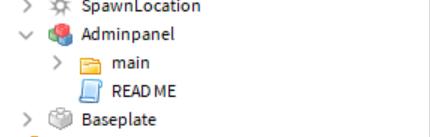
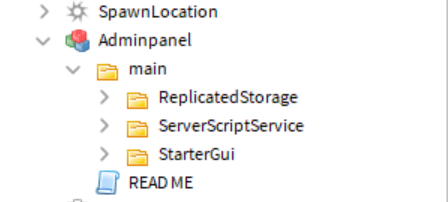
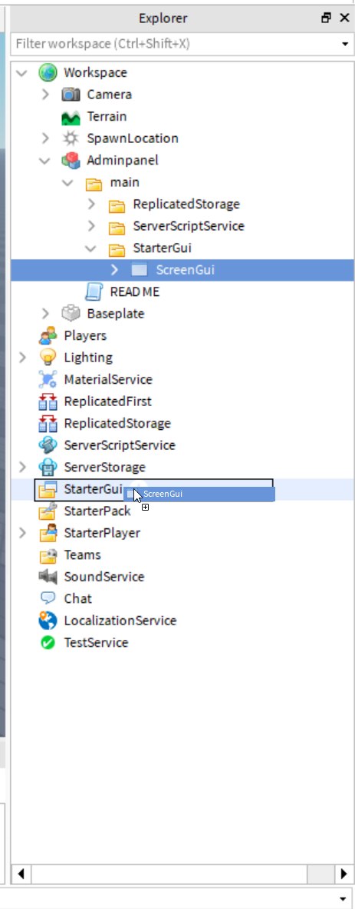

# Admin Panel install

When you install the model, This will show up in "Workspace"

You will need to open the "Main" folder.

Next you will see folders inside the main folder.

In those folders you will need to drag **all** the contents into what the folder name is.
Example: 

If you need more help, contact support in our discord server!