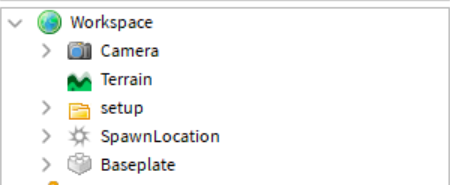

# Ground crew lights setup
First turn on HTTP requests.
When you install the model, This will show up in "Workspace"

Put the tool "Light" where you would like. If you want to change the tool name tell me (noah01q#0001) and I will help.

Put the GUI "ScreenGui" in StarterGui

If you need more help, contact support in our discord server!